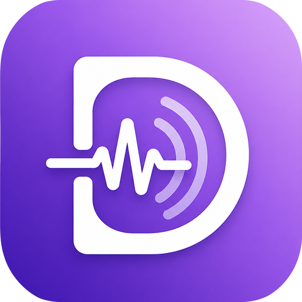

# DeFoTic — 틱장애 자동 맥락 기록 웨어러블 시스템

<p align="center"></p>

DeFoTic은 틱장애(투렛 증후군) CBIT(포괄적 행동 중재) 치료를 돕는 **자동 맥락 기록 시스템**입니다.
목걸이형 웨어러블(XIAO ESP32-S3 Sense)이 온디바이스 Edge AI로 음성 틱을 감지하고,
틱 발생 **직전 상황의 영상·음성**을 SD 카드에 선별 저장합니다. 환자는 기기를 하루 종일
착용하기만 하면 되고, 귀가 후 스마트폰에 C-to-C 케이블을 연결하면 앱이 쌓인 미디어를
자동으로 가져와 LLM 멀티모달 분석으로 틱 유형·강도·트리거·상황 맥락을 기록합니다.

## 시스템 구성

```
[웨어러블 기기]  XIAO ESP32-S3 Sense (카메라 + PDM 마이크 + SD)
   ├─ Edge Impulse 온디바이스 음성 틱 감지 (FreeRTOS 6태스크)
   ├─ 순환 버퍼: 직전 3분 영상/음성 상시 기록 → 감지 시 이벤트로 승격
   └─ 이중 통신 (투트랙)
        ├─ BLE: 이벤트 메타데이터 + 3초 주기 상태 텔레메트리 (실시간)
        └─ USB MSC(C-to-C): SD를 USB 드라이브로 노출 → 미디어 대량 동기화
[모바일 앱]  Expo(React Native) — 환자용
   ├─ 케이블 연결 감지 → 백로그 전체 자동 가져오기 (SAF, 최초 1회 폴더 지정)
   ├─ LLM 멀티모달 분석 (CBIT 기능 평가: ABC + 전구 신호 + 경쟁 반응)
   └─ 감지 정확도 개선 루프 (피드백 라벨 → 재학습 데이터셋 내보내기)
[의료진 웹]  동일 코드베이스의 웹 빌드 — 환자 코드로 분석 결과 열람
   └─ Firebase Firestore 메타 동기화 (영상/음성 원본은 업로드하지 않음)
```

## 저장소 구조

| 경로 | 내용 |
|---|---|
| `Hardware/defotic/` | 펌웨어 (Arduino, ESP32-S3) — 태스크/AI/텔레메트리/USB MSC |
| `app/` | 화면 (Expo Router) — 탭 4종 + 페어링/로그인 + 의료진 라우트 |
| `services/` | BLE 관리, 미디어 동기화, LLM 분석, Firebase, 미디어 파서 |
| `stores/` | 전역 상태 (zustand) — 이벤트/기기 상태 |
| `components/` | 이벤트 카드, 프레임 뷰어, 의료진 웹 뷰어 등 |
| `assets/` | 앱 아이콘/스플래시/로고 |

## 빌드 및 실행

### 앱 (Android)

```bash
npm install
# LLM API 키 설정 (.env — 커밋되지 않음)
echo "EXPO_PUBLIC_LLM_API_KEY=<발급받은 키>" > .env
npm run android          # 네이티브 빌드 + 설치 (Expo SDK 54)
```

- 의료진 웹: `npx expo start --web` → `/doctor` 로 진입 (웹 빌드는 자동으로 의료진 랜딩이 기본).
- Firebase(의료진 클라우드 열람)는 `constants/firebase-config.ts`의 프로젝트 설정으로 동작하며,
  비워두면 앱은 로컬 전용으로 동작합니다.

### 펌웨어 (Arduino IDE)

보드: **XIAO_ESP32S3** — Tools 설정을 아래로 고정한 뒤 Upload(BOOT 버튼 부트로더 진입):

| Tools 항목 | 값 |
|---|---|
| USB Mode | **USB-OTG (TinyUSB)** |
| USB CDC On Boot | **Disabled** (실사용 프로파일 — 폰에서 USB 드라이브로 인식되기 위한 필수 조건) |
| PSRAM | **OPI PSRAM** |

- 시리얼 디버깅이 필요할 때만 `USB CDC On Boot = Enabled`(개발 프로파일)로 빌드합니다 —
  이 프로파일은 복합 USB 장치가 되어 폰에서 드라이브가 표시되지 않습니다.
- IDE 컴파일 중 메모리 부족이 나는 환경에서는 `Hardware/build_release.bat`(병렬도 제한 빌드)을
  예비 수단으로 사용할 수 있습니다.

## 데이터 흐름 (사용자 시나리오)

1. 기기 착용 → BLE 시간 동기화(앱 최초 연결) 후 상시 순환 녹화 + AI 감지
2. 틱 감지 → 직전 3분 세그먼트를 `SD:/DEFOTIC/evt_*/`로 승격 저장 + BLE 메타 1패킷 전송
3. 귀가 후 C-to-C 연결 → 드라이브 즉시 노출(**녹화도 계속됨** — 동시 접근 구조)
   → 앱이 케이블을 감지해 백로그 전체를 배치로 자동 가져오기
4. 가져온 이벤트마다 LLM 멀티모달 분석 → 분석 카드/통계/의료진 공유
