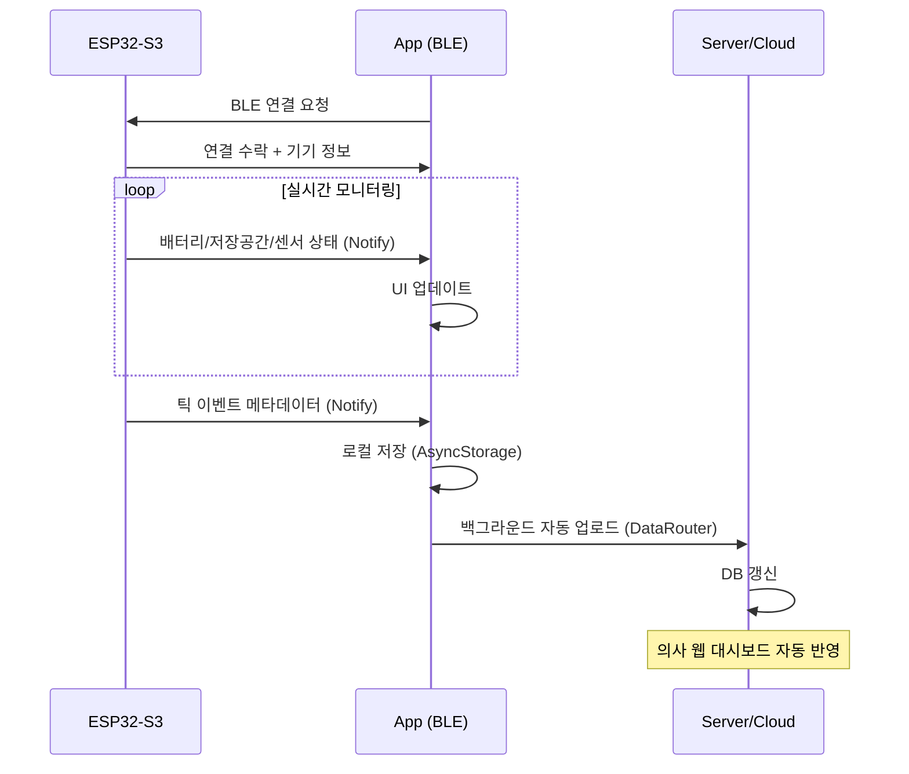

# DeFoTic — 단일 코드베이스 기반 SW 애플리케이션 구현 계획

틱장애(투렛 증후군) 자동 감지·기록 웨어러블 시스템의 **모바일 앱 + 의료진 웹 대시보드** 통합 개발

---

## 1. 개발 개요

### 프로젝트 목표
ESP32-S3 Sense 웨어러블 기기와 BLE 연동하여 틱 이벤트를 자동 수집·분석하고, **환자/보호자**에게는 모바일 앱으로, **주치의/전문 치료사**에게는 웹 브라우저(HTML)로 동일한 데이터 분석 경험을 제공합니다.

### 단일 코드베이스(Single Codebase) 아키텍처

```
[ 단일 React Native 프로젝트 소스 코드 ]
                    │
     ┌──────────────┴──────────────┐
     ▼ (Native Build)              ▼ (Web/HTML Build)
[ 모바일 앱 빌드 ]            [ HTML 웹 페이지 빌드 ]
- 대상: 환자/보호자           - 대상: 주치의/전문 치료사
- 플랫폼: Android             - 플랫폼: PC 웹 브라우저 (URL)
- BLE 페어링, 기기 제어       - 환자 상세 틱 분석, 영상 시청
```

> [!IMPORTANT]
> React Native + React Native Web(react-native-web)을 사용하여, 데이터 분석 화면 등 핵심 UI 컴포넌트를 모바일·웹 양쪽에서 **동일한 소스코드**로 렌더링합니다.

---

## 2. User Review Required

> [!WARNING]
> **프레임워크 선택**: 기획서에는 "React Native with React Native Web"이 명시되어 있습니다. 본 계획은 **Expo SDK 52 (Managed Workflow)** 기반으로 설계하였습니다. Expo는 React Native Web을 기본 지원하며, BLE 연동은 `expo-dev-client` + `react-native-ble-plx`로 커스텀 네이티브 빌드를 통해 지원합니다.

> [!IMPORTANT]
> **ESP32-S3 BLE 프로토콜**: 하드코딩 없이 BLE 연동을 구현하기 위해, ESP32-S3 펌웨어에서 노출하는 **BLE Service UUID와 Characteristic UUID**가 필요합니다. 현재 계획에서는 일반적인 UUID 패턴을 기본값으로 사용하되, 설정 파일(`ble-config.ts`)에서 쉽게 변경할 수 있도록 설계합니다.

> [!IMPORTANT]
> **서버/DB**: 기획서에 "클라우드 데이터베이스로 실시간 자동 데이터 라우팅"이 언급되어 있으나, 현 단계에서는 **로컬 데이터 + Mock API**로 UI/UX를 먼저 완성하고, 이후 Firebase/Supabase 등의 백엔드를 연동하는 방향으로 진행합니다.

---

## 3. Resolved Questions

> [!NOTE]
> 1. **ESP32-S3 BLE Service/Characteristic UUID**: 확정됨. (Service: `4fafc201-1fb5-459e-8fcc-c5c9c331914b`, Characteristic: `beb5483e-36e1-4688-b7f5-ea07361b26a8`)
> 2. **백엔드 선택**: Firebase DB로 진행 확정. 로컬 데이터 연동 완료 후 Firebase 연동 전 사용자에게 진행 여부 확인 예정.
> 3. **의사 인증**: 환자 앱에서 제공되는 환자 식별 코드(간단한 숫자)를 입력하여 의사가 로그인하는 방식으로 확정.
> 4. **디자인 에셋**: 추후 공유 시 반영 예정. 현재는 기본 와이어프레임 톤앤매너(보라색/그래디언트) 적용.

---

## 4. 기술 스택

| 기술/패키지 | 버전 | 용도 |
|---|---|---|
| **React Native** | 0.76+ | 모바일 앱 코어 |
| **Expo SDK** | 52 | 관리형 워크플로우, 웹 빌드 지원 |
| **react-native-web** | 0.19+ | 웹 빌드 (의료진 대시보드) |
| **react-native-ble-plx** | 3.x | ESP32-S3 BLE 통신 |
| **expo-router** | 4.x | 파일 기반 라우팅 (앱/웹 공용) |
| **react-native-chart-kit** | 6.x | 틱 빈도 차트 시각화 |
| **@react-native-async-storage/async-storage** | 2.x | 로컬 데이터 저장 |
| **react-native-reanimated** | 3.x | 고성능 애니메이션 |
| **expo-av** | 15.x | 영상 재생 (의료진 분석용) |
| **TypeScript** | 5.x | 타입 안전성 |

---

## 5. 프로젝트 폴더 구조

```
defotic-app/
├── app/                           # expo-router 파일 기반 라우팅
│   ├── _layout.tsx                # 루트 레이아웃 (네비게이션 컨테이너)
│   ├── index.tsx                  # 인트로 화면 (앱 전용)
│   ├── pairing.tsx                # BLE 페어링 화면 (앱 전용)
│   ├── login.tsx                  # 로그인/회원가입 화면 (앱 전용)
│   ├── (tabs)/                    # 탭 네비게이션 (메인 허브)
│   │   ├── _layout.tsx            # 탭 레이아웃
│   │   ├── index.tsx              # 매인화면 (카드 내비게이션)
│   │   ├── device.tsx             # 기기 상태 화면 (앱 전용)
│   │   ├── record.tsx             # 데이터 기록 화면 (앱 전용)
│   │   └── analysis.tsx           # 데이터 분석 화면 (앱+웹 공유 ★)
│   └── doctor/                    # 의료진 전용 웹 라우트
│       └── analysis/
│           └── [patientId].tsx    # /doctor/analysis/:patientId (웹 전용)
├── components/                    # 재사용 UI 컴포넌트
│   ├── ui/                        # 공통 UI (버튼, 카드, 모달 등)
│   │   ├── GlassCard.tsx
│   │   ├── GradientButton.tsx
│   │   ├── AnimatedProgress.tsx
│   │   └── StatusBadge.tsx
│   ├── charts/                    # 차트 컴포넌트
│   │   ├── BarChart.tsx           # 시간대별 틱 빈도 막대그래프
│   │   └── TrendChart.tsx         # 트렌드 차트
│   ├── device/                    # 기기 관련 컴포넌트
│   │   ├── BatteryIndicator.tsx
│   │   ├── StorageIndicator.tsx
│   │   └── SensorStatus.tsx
│   └── analysis/                  # 분석 관련 컴포넌트 (웹/앱 공유)
│       ├── TicEventCard.tsx       # 틱 이벤트 카드 (썸네일+설명)
│       ├── VideoPlayer.tsx        # 영상 재생기
│       └── ContextTimeline.tsx    # 상황 맥락 타임라인
├── services/                      # 비즈니스 로직 서비스
│   ├── ble/
│   │   ├── BleManager.ts          # BLE 연결/해제 관리
│   │   ├── BleConfig.ts           # Service/Characteristic UUID 설정
│   │   ├── DeviceSync.ts          # 기기→앱 데이터 동기화
│   │   └── DeviceMonitor.ts       # 실시간 기기 상태 모니터링
│   ├── data/
│   │   ├── TicEventStore.ts       # 틱 이벤트 로컬 저장소
│   │   ├── SessionManager.ts      # 세션 관리
│   │   └── DataRouter.ts          # 서버 동기화 (자동 업로드)
│   └── platform/
│       └── PlatformGuard.ts       # 플랫폼별 기능 분기 (Native vs Web)
├── hooks/                         # 커스텀 React Hooks
│   ├── useBleDevice.ts            # BLE 기기 연결 훅
│   ├── useDeviceStatus.ts         # 기기 상태 구독 훅
│   ├── useTicEvents.ts            # 틱 이벤트 데이터 훅
│   └── usePlatform.ts             # 플랫폼 감지 훅
├── constants/
│   ├── theme.ts                   # 디자인 토큰 (색상, 타이포, 간격)
│   ├── ble-config.ts              # BLE UUID 설정 (하드코딩 방지)
│   └── app-config.ts              # 앱 설정 상수
├── types/                         # TypeScript 타입 정의
│   ├── ble.ts                     # BLE 관련 타입
│   ├── tic-event.ts               # 틱 이벤트 타입
│   ├── device.ts                  # 기기 상태 타입
│   └── navigation.ts              # 네비게이션 타입
├── assets/                        # 정적 에셋
│   ├── images/
│   └── animations/
├── app.json                       # Expo 설정
├── package.json
└── tsconfig.json
```

---

## 6. 화면별 상세 기능 명세

### ① 인트로 화면 (Intro) — 앱 전용

```
┌─────────────────────────┐
│                         │
│     [DeFoTic Logo]      │
│     ⬟ 브랜드 애니메이션  │
│                         │
│  "틱장애 관리의 새로운    │
│   시작, DeFoTic"        │
│                         │
│     ── gradient ──      │
│     [Loading Pulse]     │
│                         │
└─────────────────────────┘
```

- 서비스 브랜딩 애니메이션 (fade-in + scale)
- 세션 초기화 (AsyncStorage 로드)
- 3초 후 자동 전환 → 페어링 화면 or 메인화면 (이전 연결 기록 확인)

---

### ② 페어링 화면 (BLE Pairing) — 앱 전용

```
┌─────────────────────────┐
│  ← 뒤로                 │
│                         │
│  🔵 기기 검색 중...       │
│  [Scanning Animation]   │
│                         │
│  ┌─────────────────────┐│
│  │ 📱 DeFoTic-001      ││
│  │    RSSI: -42dBm      ││
│  │    [연결하기]         ││
│  └─────────────────────┘│
│  ┌─────────────────────┐│
│  │ 📱 DeFoTic-002      ││
│  │    RSSI: -67dBm      ││
│  │    [연결하기]         ││
│  └─────────────────────┘│
│                         │
│  [수동 입력으로 연결]     │
└─────────────────────────┘
```

- `react-native-ble-plx`로 ESP32-S3 디바이스 스캔
- BLE Service UUID 필터링 (DeFoTic 전용 기기만 표시)
- 탭하여 페어링 → 연결 성공 시 로그인 화면 이동
- **하드코딩 없는 설계**: `ble-config.ts`에서 UUID 변경만으로 다른 기기도 지원

---

### ③ 로그인 화면 (Login) — 앱 전용

```
┌─────────────────────────┐
│                         │
│  👤 환자 정보 입력        │
│                         │
│  이름: [____________]    │
│  연락처: [____________]  │
│  주치의 코드: [________] │
│  소속 기관: [__________] │
│                         │
│  [시작하기 ▶]           │
│                         │
└─────────────────────────┘
```

- 환자 식별 기본 정보 입력
- 주치의 코드 입력 → 의사 대시보드 연동용 URL 자동 생성
- AsyncStorage로 로컬 저장

---

### ④ 매인화면 (Main Screen) — 앱 전용

```
┌─────────────────────────┐
│        DeFoTic          │
│                         │
│  ┌───────────────────┐  │
│  │  ▲ 기기 상태       │  │ ← 상단 스와이프/탭
│  │  [Device-01 연결됨] │  │
│  └───────────────────┘  │
│                         │
│  ┌───────────────────┐  │
│  │  ▼ 데이터 기록     │  │ ← 하단 스와이프/탭
│  │  [오늘 12건 감지]   │  │
│  └───────────────────┘  │
│                         │
│  ┌───────────────────┐  │
│  │  ▶ 데이터 분석     │  │ ← 우측 스와이프/탭
│  │  [AI 상황분석 보기] │  │
│  └───────────────────┘  │
│                         │
└─────────────────────────┘
```

- 카드 레이아웃 3방향 내비게이션
- 스와이프 제스처 + 탭 지원 (`react-native-gesture-handler`)
- 각 카드에 실시간 요약 정보 표시 (BLE 데이터 구독)

---

### ⑤ 기기 상태 화면 (Device Status) — 앱 전용

```
┌─────────────────────────┐
│  ← 메인  기기 상태       │
│                         │
│  ┌───────────────────┐  │
│  │  [기기 이미지]      │  │
│  │  Device-01         │  │
│  │  ● 연결됨           │  │
│  └───────────────────┘  │
│                         │
│  🔋 배터리    ████░ 78%  │
│  💾 SD카드   ███░░ 62%  │
│                         │
│  ── 센서 상태 ──        │
│  🎤 마이크     ● 활성    │
│  📷 카메라     ● 활성    │
│  🌡 온도       32.5°C   │
│                         │
│  마지막 동기화: 5분 전    │
│  [동기화 시작 ▶]         │
└─────────────────────────┘
```

- BLE Characteristic 구독으로 실시간 상태 업데이트
- 배터리/저장공간/센서 상태 시각적 표시
- 수동 동기화 트리거 버튼

---

### ⑥ 데이터 기록 화면 (Data Record) — 앱 전용

```
┌─────────────────────────┐
│  ← 메인  데이터 기록      │
│                         │
│  ┌───────────────────┐  │
│  │ 📊 총 틱 발생      │  │
│  │    87회            │  │
│  │ ⏰ 취약 시간대      │  │
│  │    10:00~14:00     │  │
│  └───────────────────┘  │
│                         │
│  ── 시간대별 분포 ──    │
│  │████                │  │
│  │██████████          │  │  ← Bar Chart
│  │████████████████    │  │
│  │████████████        │  │
│  │██████              │  │
│  │████                │  │
│  └──────────────────  │  │
│   06  09  12  15  18  21│
│                         │
│  기간: [오늘] [주간] [월] │
└─────────────────────────┘
```

- BLE 동기화된 데이터 기반 대시보드
- 막대그래프로 시간대별 틱 검출 빈도 시각화
- 기간 필터 (일/주/월)

---

### ⑦ 데이터 분석 화면 (Data Analysis) — ★앱 및 HTML 웹 공유

```
┌─────────────────────────┐
│  ← 메인  데이터 분석      │
│                         │
│  ── 상황 맥락 분석 ──    │
│  ┌───────────────────┐  │
│  │ 📸 [썸네일]  10:23  │  │
│  │    "점심 식사시간"   │  │
│  │    틱 유형: 음성     │  │
│  │    [상세 보기 ▶]    │  │
│  └───────────────────┘  │
│  ┌───────────────────┐  │
│  │ 📸 [썸네일]  14:07  │  │
│  │    "수업 시간"      │  │
│  │    틱 유형: 운동     │  │
│  │    [상세 보기 ▶]    │  │
│  └───────────────────┘  │
│  ┌───────────────────┐  │
│  │ 📸 [썸네일]  16:42  │  │
│  │    "수학"           │  │
│  │    [상세 보기 ▶]    │  │
│  └───────────────────┘  │
│                         │
└─────────────────────────┘
```

- AI 감지된 이상행동(틱) 목록 카드
- **동일한 컴포넌트**가 앱과 웹 양쪽에서 렌더링
- 웹 버전에서는 영상(±6분) PC 화면으로 크게 시청 가능
- 의사는 URL로 직접 접근: `https://defotic.com/doctor/analysis/patient_01`

---

### ⑧ 전송 화면 (폐기) — 설계 기록 보존

> [!NOTE]
> **폐기 사유**: 초기 설계에 존재하던 '수동 전송 화면'은 최종 설계에서 배제되었습니다. 틱 환자가 데이터를 매번 수동으로 전송하는 번거로움을 없애기 위해, **BLE 동기화 완료 시 백그라운드에서 클라우드 DB로 실시간 자동 라우팅**하도록 시스템을 고도화했습니다. 이 결정은 `DataRouter.ts` 서비스에 반영됩니다.

---

## 7. ESP32-S3 BLE 연동 설계 (하드코딩 방지)

### BLE Service/Characteristic 구조 (설정 파일 기반)

```typescript
// constants/ble-config.ts
export const BLE_CONFIG = {
  // ESP32-S3 DeFoTic 디바이스 필터
  DEVICE_NAME_PREFIX: 'DeFoTic',
  
  // BLE Service UUIDs (ESP32 펌웨어에서 정의한 값)
  SERVICES: {
    TIC_DATA:       '4fafc201-1fb5-459e-8fcc-c5c9c331914b',  // 메인 서비스 UUID
    DEVICE_INFO:    '0000180a-0000-1000-8000-00805f9b34fb',  // Device Information
    BATTERY:        '0000180f-0000-1000-8000-00805f9b34fb',  // Battery Service
  },
  
  // Characteristic UUIDs
  CHARACTERISTICS: {
    TIC_EVENT_STREAM: 'beb5483e-36e1-4688-b7f5-ea07361b26a8', // 메인 캐릭터리스틱 UUID
    BATTERY_LEVEL:    '00002a19-0000-1000-8000-00805f9b34fb',
  },
  
  // 연결 설정
  CONNECTION: {
    SCAN_TIMEOUT_MS: 10000,
    CONNECTION_TIMEOUT_MS: 5000,
    AUTO_RECONNECT: true,
    MAX_RECONNECT_ATTEMPTS: 3,
  }
} as const;
```

### 데이터 동기화 흐름



---

## 8. 웹(HTML) 접근성 및 라우팅 설계

### 플랫폼별 기능 분기

```typescript
// services/platform/PlatformGuard.ts
import { Platform } from 'react-native';

export const PlatformGuard = {
  isNative: Platform.OS !== 'web',
  isWeb: Platform.OS === 'web',
  
  // 네이티브 전용 기능 (BLE, 카메라 등)
  requiresNative: (featureName: string) => {
    if (Platform.OS === 'web') {
      console.warn(`[PlatformGuard] ${featureName}은 모바일 앱에서만 사용 가능합니다.`);
      return false;
    }
    return true;
  }
};
```

### 라우팅 설계

```typescript
// app/_layout.tsx
// 앱 전용 화면: /, /pairing, /login, /device, /record
// 앱+웹 공유:  /analysis
// 웹 전용:    /doctor/analysis/[patientId]
```

의사 접근 플로우:
1. 환자가 앱에서 생성된 '환자 식별 코드(숫자)'를 의사에게 전달
2. 의사가 `https://defotic.com/doctor/analysis` 접속
3. 환자 식별 코드(숫자)를 입력하여 로그인 인증 후 **데이터 분석 화면(HTML 빌드 버전)** 직접 랜딩
4. PC 화면에서 영상 시청 + CBIT 치료 계획 수립

---

## 9. Proposed Changes

### Phase 1: 프로젝트 초기화 및 디자인 시스템 ──────────────────

#### [NEW] 프로젝트 셋업
- Expo SDK 52 + TypeScript 프로젝트 생성
- 필수 패키지 설치 (react-native-ble-plx, chart-kit, reanimated 등)
- expo-router 파일 기반 라우팅 구성

#### [NEW] [theme.ts](file:///c:/Users/user/Desktop/DeFoTic%20React%20Application/constants/theme.ts)
- 와이어프레임 기반 보라색/그래디언트 컬러 팔레트
- 타이포그래피 (Pretendard / Noto Sans KR)
- 글래스모피즘 카드 스타일
- 반응형 간격 시스템

#### [NEW] 공통 UI 컴포넌트
- `GlassCard.tsx` — 반투명 카드 (글래스모피즘)
- `GradientButton.tsx` — 그래디언트 버튼
- `AnimatedProgress.tsx` — 애니메이션 프로그레스 바
- `StatusBadge.tsx` — 상태 뱃지

---

### Phase 2: 앱 전용 화면 (인트로 → 페어링 → 로그인 → 메인) ────

#### [NEW] [index.tsx](file:///c:/Users/user/Desktop/DeFoTic%20React%20Application/app/index.tsx)
- 인트로 화면: 브랜딩 애니메이션, 자동 전환

#### [NEW] [pairing.tsx](file:///c:/Users/user/Desktop/DeFoTic%20React%20Application/app/pairing.tsx)
- BLE 디바이스 스캔 UI
- ESP32-S3 기기 목록 표시 및 페어링

#### [NEW] [login.tsx](file:///c:/Users/user/Desktop/DeFoTic%20React%20Application/app/login.tsx)
- 환자 정보 입력 폼
- 주치의 코드 연동

#### [NEW] [(tabs)/index.tsx](file:///c:/Users/user/Desktop/DeFoTic%20React%20Application/app/(tabs)/index.tsx)
- 3방향 카드 네비게이션 메인 허브

---

### Phase 3: BLE 서비스 레이어 ──────────────────────────────

#### [NEW] [BleConfig.ts](file:///c:/Users/user/Desktop/DeFoTic%20React%20Application/services/ble/BleConfig.ts)
- Service/Characteristic UUID 설정 (하드코딩 방지)

#### [NEW] [BleManager.ts](file:///c:/Users/user/Desktop/DeFoTic%20React%20Application/services/ble/BleManager.ts)
- BLE 스캔, 연결, 해제, 자동 재연결
- ESP32-S3 Sense 모델 전용 최적화

#### [NEW] [DeviceSync.ts](file:///c:/Users/user/Desktop/DeFoTic%20React%20Application/services/ble/DeviceSync.ts)
- SD카드 데이터 → 앱 동기화
- 이벤트 메타데이터 우선 동기화, 영상 클립 후속 전송

#### [NEW] [DeviceMonitor.ts](file:///c:/Users/user/Desktop/DeFoTic%20React%20Application/services/ble/DeviceMonitor.ts)
- 배터리/저장공간/센서 실시간 모니터링 (BLE Notify)

---

### Phase 4: 기기 상태 + 데이터 기록 화면 ──────────────────────

#### [NEW] [(tabs)/device.tsx](file:///c:/Users/user/Desktop/DeFoTic%20React%20Application/app/(tabs)/device.tsx)
- 기기 상태 실시간 대시보드
- 배터리, SD카드, 센서 상태 표시

#### [NEW] [(tabs)/record.tsx](file:///c:/Users/user/Desktop/DeFoTic%20React%20Application/app/(tabs)/record.tsx)
- 틱 발생 횟수/취약 시간대 대시보드
- 시간대별 Bar Chart

#### [NEW] 차트 컴포넌트
- `BarChart.tsx` — 시간대별 분포
- `TrendChart.tsx` — 트렌드 추이

---

### Phase 5: 데이터 분석 화면 (앱+웹 공유) ──────────────────────

#### [NEW] [(tabs)/analysis.tsx](file:///c:/Users/user/Desktop/DeFoTic%20React%20Application/app/(tabs)/analysis.tsx)
- 상황 맥락 분석 리스트 (앱 내 뷰)

#### [NEW] [doctor/analysis/[patientId].tsx](file:///c:/Users/user/Desktop/DeFoTic%20React%20Application/app/doctor/analysis/%5BpatientId%5D.tsx)
- 의료진 전용 웹 페이지 (HTML 단독 렌더링)
- PC 대형 화면 최적화 레이아웃
- 영상 플레이어 (±6분 클립 재생)

#### [NEW] 분석 공용 컴포넌트
- `TicEventCard.tsx` — 앱/웹 공유 이벤트 카드
- `VideoPlayer.tsx` — 영상 재생기
- `ContextTimeline.tsx` — 상황 맥락 타임라인

---

### Phase 6: 자동 데이터 라우팅 (전송 화면 폐기 반영) ──────────

#### [NEW] [DataRouter.ts](file:///c:/Users/user/Desktop/DeFoTic%20React%20Application/services/data/DataRouter.ts)
- BLE 동기화 완료 시 자동 서버 업로드
- 수동 전송 UI 불필요 (폐기 사유 구현)
- 네트워크 상태 감지 + 재전송 큐

#### [NEW] [TicEventStore.ts](file:///c:/Users/user/Desktop/DeFoTic%20React%20Application/services/data/TicEventStore.ts)
- 로컬 이벤트 저장/조회/필터
- AsyncStorage 기반

---

## 10. 디자인 시스템 (와이어프레임 기반)

### 컬러 팔레트

| 용도 | 색상 | 코드 |
|---|---|---|
| **Primary** | Deep Purple | `#7B2FBE` |
| **Primary Light** | Soft Lavender | `#B47AEA` |
| **Primary Dark** | Rich Purple | `#4A1A72` |
| **Background** | Dark Navy | `#0D0B1A` |
| **Surface** | Glass Purple | `rgba(123, 47, 190, 0.15)` |
| **Accent** | Vivid Magenta | `#E91E8C` |
| **Success** | Mint Green | `#00E676` |
| **Warning** | Amber | `#FFB300` |
| **Error** | Coral Red | `#FF5252` |
| **Text Primary** | White | `#FFFFFF` |
| **Text Secondary** | Light Gray | `#B0B0CC` |

### 디자인 원칙
- **글래스모피즘**: 반투명 카드 + backdrop blur
- **그래디언트**: Primary → Accent 그래디언트 배경/버튼
- **마이크로 애니메이션**: 모든 전환에 spring 커브 적용
- **다크 모드 기본**: 와이어프레임의 어두운 톤 유지

---

## 11. Verification Plan

### Automated Tests
```bash
# Expo 프로젝트 빌드 검증
npx expo start --web     # 웹 빌드 확인
npx expo start           # 네이티브 빌드 확인

# TypeScript 검증
npx tsc --noEmit

# 린트
npx eslint . --ext .ts,.tsx
```

### Manual Verification
- **웹 브라우저**: `npx expo start --web`으로 의료진 대시보드 UI 확인
- **Android 실기기**: `npx expo run:android`로 BLE 페어링 + 전체 UX 흐름 테스트
- **ESP32-S3 연동**: 실제 BLE 기기 스캔 → 페어링 → 데이터 수신 검증

### BLE 연동 테스트
1. ESP32-S3 전원 ON → 앱에서 기기 스캔 확인
2. 기기 탭 → 페어링 완료 확인
3. 기기 상태 (배터리/저장/센서) 실시간 표시 확인
4. 틱 이벤트 수신 + 데이터 기록 화면 반영 확인
5. 분석 화면 → 웹 URL 접근 시 동일 데이터 표시 확인
